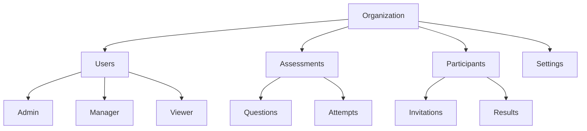

# Organizations

Organizations are the top-level entity in Skillment that provide complete data isolation and multi-tenancy. Each organization has its own subdomain, users, assessments, and participants.

## Key Concepts

<CardGroup cols={2}>
  <Card title="Multi-Tenancy" icon="building">
    Complete data isolation between organizations
  </Card>
  <Card title="Custom Subdomains" icon="globe">
    Each organization gets a unique subdomain
  </Card>
  <Card title="Team Management" icon="users">
    Multiple users with role-based permissions
  </Card>
  <Card title="Plan-based Features" icon="star">
    Features vary by subscription plan
  </Card>
</CardGroup>

## Organization Structure



## Organization Properties

| Property | Type | Description |
|----------|------|-------------|
| `id` | string | Unique organization identifier |
| `name` | string | Organization name (used in subdomain) |
| `type` | string | Type of organization (technology, education, etc.) |
| `size` | string | Organization size category |
| `plan` | string | Subscription plan (`free` or `elite`) |
| `logo` | string | Organization logo URL |
| `settings` | object | Organization-specific settings |
| `createdAt` | datetime | Creation timestamp |

## Subscription Plans

### Free Plan

<AccordionGroup>
  <Accordion title="Features Included" icon="check">
    - Up to 50 participants per month
    - 5 active assessments
    - Basic proctoring features
    - Email support
    - Standard templates
  </Accordion>
  
  <Accordion title="Limitations" icon="x">
    - Limited API rate limits (100 req/min)
    - No custom branding
    - No advanced analytics
    - No webhooks
  </Accordion>
</AccordionGroup>

### Elite Plan

<AccordionGroup>
  <Accordion title="Features Included" icon="star">
    - Unlimited participants
    - Unlimited assessments
    - Advanced proctoring with AI
    - Priority support
    - Custom branding
    - Advanced analytics
    - Webhook integrations
    - Higher API rate limits (1000 req/min)
  </Accordion>
  
  <Accordion title="Pricing" icon="dollar-sign">
    - Monthly: $99/month
    - Annual: $999/year (2 months free)
    - Enterprise: Custom pricing
  </Accordion>
</AccordionGroup>

## Organization Management

### Creating an Organization

Organizations are created during the registration process:

```javascript
const organizationData = {
  email: "admin@company.com",
  password: "securePassword123",
  firstName: "John",
  lastName: "Doe",
  phone: "+1234567890",
  gender: "male",
  orgName: "my-tech-company",  // This becomes the subdomain
  orgType: "technology",
  orgSize: "50-100",
  plan: "free",
  termsAccepted: true
};
```

### Updating Organization Details

<CodeGroup>
```bash cURL
curl -X PUT https://api.skillment.in/api/organizations/my-company \
  -H "Authorization: Bearer YOUR_TOKEN" \
  -H "Content-Type: application/json" \
  -d '{
    "type": "education",
    "size": "100-500",
    "settings": {
      "allowCandidateRegistration": true,
      "defaultAssessmentDuration": 120,
      "emailNotifications": true
    }
  }'
```

```javascript JavaScript
const updateOrganization = async (orgName, updateData) => {
  const response = await fetch(`https://api.skillment.in/api/organizations/${orgName}`, {
    method: 'PUT',
    headers: {
      'Authorization': `Bearer ${token}`,
      'Content-Type': 'application/json',
    },
    body: JSON.stringify(updateData)
  });
  
  return response.json();
};
```
</CodeGroup>

### Uploading Organization Logo

<CodeGroup>
```bash cURL
curl -X POST https://api.skillment.in/api/organizations/my-company/logo \
  -H "Authorization: Bearer YOUR_TOKEN" \
  -F "logo=@/path/to/logo.png"
```

```javascript JavaScript
const uploadLogo = async (orgName, logoFile) => {
  const formData = new FormData();
  formData.append('logo', logoFile);
  
  const response = await fetch(`https://api.skillment.in/api/organizations/${orgName}/logo`, {
    method: 'POST',
    headers: {
      'Authorization': `Bearer ${token}`,
    },
    body: formData
  });
  
  return response.json();
};
```
</CodeGroup>

## Organization Settings

Organizations can be customized with various settings:

```typescript
interface OrganizationSettings {
  // Assessment Settings
  defaultAssessmentDuration: number;
  maxQuestionsPerAssessment: number;
  allowQuestionRandomization: boolean;
  
  // Proctoring Settings
  enableProctoringByDefault: boolean;
  faceDetectionSensitivity: 'low' | 'medium' | 'high';
  allowTabSwitching: boolean;
  
  // Email Settings
  emailNotifications: boolean;
  customEmailTemplates: boolean;
  senderEmail: string;
  
  // Candidate Settings
  allowCandidateRegistration: boolean;
  requirePhoneVerification: boolean;
  allowGuestAccess: boolean;
  
  // Branding (Elite only)
  customColors: {
    primary: string;
    secondary: string;
    accent: string;
  };
  customLogo: string;
  customDomain: string;
}
```

## Team Management

Organizations support multiple users with different permission levels:

### User Roles

<Tabs>
  <Tab title="Admin">
    **Full Access**
    - Manage organization settings
    - Add/remove team members
    - Create/edit/delete assessments
    - View all analytics
    - Billing management
  </Tab>
  
  <Tab title="Manager">
    **Assessment Management**
    - Create/edit/delete assessments
    - Manage participants
    - View analytics for their assessments
    - Cannot manage team or billing
  </Tab>
  
  <Tab title="Viewer">
    **Read-only Access**
    - View assessments
    - View participant results
    - Export data
    - Cannot create or modify content
  </Tab>
</Tabs>

### Adding Team Members

<CodeGroup>
```bash cURL
curl -X POST https://api.skillment.in/api/team \
  -H "Authorization: Bearer YOUR_TOKEN" \
  -H "Content-Type: application/json" \
  -d '{
    "email": "teammate@company.com",
    "firstName": "Jane",
    "lastName": "Smith",
    "role": "manager",
    "permissions": ["assessments:create", "participants:manage"]
  }'
```

```javascript JavaScript
const inviteTeamMember = async (inviteData) => {
  const response = await fetch('https://api.skillment.in/api/team', {
    method: 'POST',
    headers: {
      'Authorization': `Bearer ${token}`,
      'Content-Type': 'application/json',
    },
    body: JSON.stringify(inviteData)
  });
  
  return response.json();
};
```
</CodeGroup>

## Data Isolation

Each organization maintains complete data separation:

<AccordionGroup>
  <Accordion title="Database Level" icon="database">
    All data is tagged with organization ID and queries are automatically scoped
  </Accordion>
  
  <Accordion title="API Level" icon="code">
    JWT tokens contain organization context, ensuring users only access their data
  </Accordion>
  
  <Accordion title="File Storage" icon="folder">
    Uploaded files (logos, attachments) are stored in organization-specific directories
  </Accordion>
  
  <Accordion title="Subdomain Level" icon="globe">
    Each organization has its own subdomain for dashboard access
  </Accordion>
</AccordionGroup>

## Organization URLs

Each organization gets multiple URLs for different purposes:

```typescript
interface OrganizationUrls {
  // Main dashboard
  dashboard: "https://{orgName}.skillment.in/dashboard";
  
  // Candidate portal
  candidatePortal: "https://candidate.skillment.in/{orgName}";
  
  // API base
  api: "https://api.skillment.in/api";
  
  // Public assessment links
  publicAssessment: "https://assess.skillment.in/{orgName}/{assessmentId}";
}
```

## Best Practices

<CardGroup cols={2}>
  <Card title="Naming Convention" icon="tag">
    Use clear, professional organization names that represent your brand
  </Card>
  <Card title="Team Structure" icon="hierarchy">
    Assign appropriate roles based on team member responsibilities
  </Card>
  <Card title="Settings Configuration" icon="cog">
    Configure organization settings before creating assessments
  </Card>
  <Card title="Regular Backups" icon="floppy-disk">
    Export important data regularly for backup purposes
  </Card>
</CardGroup>

## Migration & Export

Organizations can export their data or migrate to different plans:

### Data Export

```javascript
const exportOrganizationData = async () => {
  const response = await fetch('https://api.skillment.in/api/organizations/export', {
    headers: {
      'Authorization': `Bearer ${token}`,
    }
  });
  
  // Returns a comprehensive data export
  return response.blob();
};
```

### Plan Upgrade

```javascript
const upgradePlan = async (planType) => {
  const response = await fetch('https://api.skillment.in/api/billing/upgrade', {
    method: 'POST',
    headers: {
      'Authorization': `Bearer ${token}`,
      'Content-Type': 'application/json',
    },
    body: JSON.stringify({ plan: planType })
  });
  
  return response.json();
};
```

<Note>
**Organization Name Changes**: Organization names cannot be changed after creation as they're used in subdomains and URLs. Choose carefully during registration.
</Note>