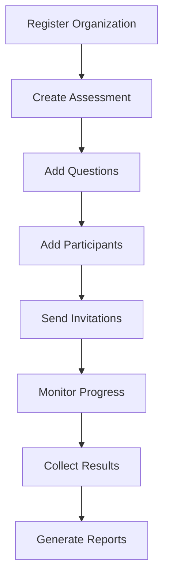

# Complete Assessment Workflow

This comprehensive example demonstrates the full lifecycle of creating and conducting an assessment using the Skillment API, from organization setup to candidate evaluation.

## Workflow Overview



## Prerequisites

Before starting, ensure you have:
- Basic understanding of REST APIs
- A development environment with HTTP request capability
- Valid email addresses for testing

## Step 1: Organization Setup

First, let's register our organization and get authentication credentials:

<CodeGroup>
```javascript Node.js
const SKILLMENT_API = 'https://api.skillment.in/api';

class SkillmentClient {
  constructor() {
    this.token = null;
    this.organization = null;
  }

  async register(orgData) {
    const response = await fetch(`${SKILLMENT_API}/auth/register`, {
      method: 'POST',
      headers: { 'Content-Type': 'application/json' },
      body: JSON.stringify(orgData)
    });

    const data = await response.json();
    if (data.success) {
      this.token = data.token;
      this.organization = data.organization;
      console.log(`✅ Organization '${data.organization.name}' registered successfully`);
      return data;
    } else {
      throw new Error(data.error);
    }
  }

  async apiCall(endpoint, options = {}) {
    const response = await fetch(`${SKILLMENT_API}${endpoint}`, {
      headers: {
        'Authorization': `Bearer ${this.token}`,
        'Content-Type': 'application/json',
        ...options.headers
      },
      ...options
    });

    const data = await response.json();
    if (!response.ok) {
      throw new Error(data.error || 'API request failed');
    }

    return data;
  }
}

// Initialize client and register organization
const client = new SkillmentClient();

const orgData = {
  email: 'admin@techcorp.com',
  password: 'SecurePass123!',
  firstName: 'Sarah',
  lastName: 'Johnson',
  phone: '+1234567890',
  gender: 'female',
  orgName: 'techcorp-assessments',
  orgType: 'technology',
  orgSize: '100-500',
  plan: 'free',
  termsAccepted: true,
  newsletterOptIn: false
};

await client.register(orgData);
```

```python Python
import requests
import json

class SkillmentClient:
    def __init__(self):
        self.base_url = 'https://api.skillment.in/api'
        self.token = None
        self.organization = None
    
    def register(self, org_data):
        """Register organization and get authentication token"""
        response = requests.post(
            f'{self.base_url}/auth/register',
            json=org_data
        )
        
        data = response.json()
        if data.get('success'):
            self.token = data['token']
            self.organization = data['organization']
            print(f"✅ Organization '{data['organization']['name']}' registered successfully")
            return data
        else:
            raise Exception(data.get('error', 'Registration failed'))
    
    def api_call(self, endpoint, method='GET', data=None):
        """Make authenticated API calls"""
        headers = {
            'Authorization': f'Bearer {self.token}',
            'Content-Type': 'application/json'
        }
        
        response = requests.request(
            method=method,
            url=f'{self.base_url}{endpoint}',
            json=data,
            headers=headers
        )
        
        if not response.ok:
            error_data = response.json()
            raise Exception(error_data.get('error', 'API request failed'))
        
        return response.json()

# Initialize client and register
client = SkillmentClient()

org_data = {
    'email': 'admin@techcorp.com',
    'password': 'SecurePass123!',
    'firstName': 'Sarah',
    'lastName': 'Johnson',
    'phone': '+1234567890',
    'gender': 'female',
    'orgName': 'techcorp-assessments',
    'orgType': 'technology',
    'orgSize': '100-500',
    'plan': 'free',
    'termsAccepted': True,
    'newsletterOptIn': False
}

registration = client.register(org_data)
```
</CodeGroup>

## Step 2: Create Assessment

Now let's create a comprehensive coding assessment:

<CodeGroup>
```javascript Node.js
const createAssessment = async () => {
  const assessmentData = {
    title: 'Full Stack Developer Assessment 2024',
    description: 'Comprehensive evaluation covering JavaScript, React, Node.js, and problem-solving skills',
    type: 'coding',
    duration: 180, // 3 hours
    questions: [
      {
        type: 'coding',
        question: `
# Array Manipulation Challenge

Write a function that takes an array of integers and returns a new array with the following transformations:
1. Remove all duplicates
2. Sort in ascending order
3. Return only even numbers

**Example:**
- Input: [4, 2, 7, 2, 8, 4, 1, 6]
- Output: [2, 4, 6, 8]
        `,
        difficulty: 'Medium',
        marks: 25,
        timeLimit: 30,
        starterCode: {
          javascript: `function processArray(nums) {
  // Your implementation here
  return [];
}

// Test cases
console.log(processArray([4, 2, 7, 2, 8, 4, 1, 6])); // Expected: [2, 4, 6, 8]`,
          python: `def process_array(nums):
    # Your implementation here
    return []

# Test cases
print(process_array([4, 2, 7, 2, 8, 4, 1, 6]))  # Expected: [2, 4, 6, 8]`,
          java: `public class Solution {
    public static int[] processArray(int[] nums) {
        // Your implementation here
        return new int[]{};
    }
    
    public static void main(String[] args) {
        int[] result = processArray(new int[]{4, 2, 7, 2, 8, 4, 1, 6});
        System.out.println(Arrays.toString(result)); // Expected: [2, 4, 6, 8]
    }
}`
        },
        testCases: [
          {
            input: '[4, 2, 7, 2, 8, 4, 1, 6]',
            expectedOutput: '[2, 4, 6, 8]',
            isVisible: true
          },
          {
            input: '[1, 3, 5, 7, 9]',
            expectedOutput: '[]',
            isVisible: true
          },
          {
            input: '[10, 20, 10, 30, 20, 40]',
            expectedOutput: '[10, 20, 30, 40]',
            isVisible: false
          },
          {
            input: '[]',
            expectedOutput: '[]',
            isVisible: false
          }
        ],
        constraints: [
          '0 ≤ nums.length ≤ 1000',
          '-1000 ≤ nums[i] ≤ 1000',
          'Time complexity should be O(n log n) or better'
        ]
      },
      {
        type: 'coding',
        question: `
# React Component Challenge

Create a React functional component called \`UserCard\` that displays user information with the following features:

1. Accepts props: \`user\` (object with name, email, avatar), \`onEdit\` (function)
2. Shows user avatar, name, and email
3. Has an "Edit" button that calls \`onEdit\` with user ID
4. Uses proper React hooks for state management
5. Includes hover effects and responsive design

The component should handle missing avatar gracefully with a default placeholder.
        `,
        difficulty: 'Hard',
        marks: 35,
        timeLimit: 45,
        starterCode: {
          javascript: `import React, { useState } from 'react';

const UserCard = ({ user, onEdit }) => {
  // Your implementation here
  
  return (
    <div>
      {/* Your JSX here */}
    </div>
  );
};

export default UserCard;

// Example usage:
// <UserCard 
//   user={{ id: 1, name: "John Doe", email: "john@example.com", avatar: "https://..." }}
//   onEdit={(userId) => console.log('Edit user:', userId)}
// />`
        },
        testCases: [
          {
            input: 'Component renders with valid user data',
            expectedOutput: 'Displays name, email, and avatar correctly',
            isVisible: true
          },
          {
            input: 'User object missing avatar property',
            expectedOutput: 'Shows default placeholder avatar',
            isVisible: true
          },
          {
            input: 'Edit button clicked',
            expectedOutput: 'Calls onEdit function with correct user ID',
            isVisible: false
          }
        ]
      }
    ],
    settings: {
      proctoringEnabled: true,
      randomizeQuestions: false,
      showResults: false,
      allowRetakes: false,
      requireFullscreen: true,
      blockCopyPaste: true,
      recordScreen: true
    }
  };

  const assessment = await client.apiCall('/assessments', {
    method: 'POST',
    body: JSON.stringify(assessmentData)
  });

  console.log(`✅ Assessment created: ${assessment.id}`);
  return assessment;
};

const assessment = await createAssessment();
```

```python Python
def create_assessment():
    """Create a comprehensive coding assessment"""
    assessment_data = {
        'title': 'Full Stack Developer Assessment 2024',
        'description': 'Comprehensive evaluation covering JavaScript, React, Node.js, and problem-solving skills',
        'type': 'coding',
        'duration': 180,  # 3 hours
        'questions': [
            {
                'type': 'coding',
                'question': '''
# Array Manipulation Challenge

Write a function that takes an array of integers and returns a new array with the following transformations:
1. Remove all duplicates
2. Sort in ascending order  
3. Return only even numbers

**Example:**
- Input: [4, 2, 7, 2, 8, 4, 1, 6]
- Output: [2, 4, 6, 8]
                ''',
                'difficulty': 'Medium',
                'marks': 25,
                'timeLimit': 30,
                'starterCode': {
                    'python': '''def process_array(nums):
    # Your implementation here
    return []

# Test cases
print(process_array([4, 2, 7, 2, 8, 4, 1, 6]))  # Expected: [2, 4, 6, 8]''',
                    'javascript': '''function processArray(nums) {
  // Your implementation here
  return [];
}

// Test cases
console.log(processArray([4, 2, 7, 2, 8, 4, 1, 6])); // Expected: [2, 4, 6, 8]'''
                },
                'testCases': [
                    {
                        'input': '[4, 2, 7, 2, 8, 4, 1, 6]',
                        'expectedOutput': '[2, 4, 6, 8]',
                        'isVisible': True
                    },
                    {
                        'input': '[1, 3, 5, 7, 9]',
                        'expectedOutput': '[]',
                        'isVisible': True
                    },
                    {
                        'input': '[10, 20, 10, 30, 20, 40]',
                        'expectedOutput': '[10, 20, 30, 40]',
                        'isVisible': False
                    }
                ],
                'constraints': [
                    '0 ≤ nums.length ≤ 1000',
                    '-1000 ≤ nums[i] ≤ 1000',
                    'Time complexity should be O(n log n) or better'
                ]
            }
        ],
        'settings': {
            'proctoringEnabled': True,
            'randomizeQuestions': False,
            'showResults': False,
            'allowRetakes': False,
            'requireFullscreen': True,
            'blockCopyPaste': True,
            'recordScreen': True
        }
    }
    
    assessment = client.api_call('/assessments', method='POST', data=assessment_data)
    print(f"✅ Assessment created: {assessment['id']}")
    return assessment

assessment = create_assessment()
```
</CodeGroup>

## Step 3: Participant Management

Let's add participants who will take the assessment:

<CodeGroup>
```javascript Node.js
const addParticipants = async () => {
  const participants = [
    {
      firstName: 'Alex',
      lastName: 'Chen',
      email: 'alex.chen@email.com',
      phone: '+1234567891',
      tags: ['frontend', 'react', 'javascript'],
      customFields: {
        experience: '3-5 years',
        currentRole: 'Frontend Developer',
        preferredStack: 'React/Node.js'
      }
    },
    {
      firstName: 'Maria',
      lastName: 'Rodriguez',
      email: 'maria.rodriguez@email.com',
      phone: '+1234567892',
      tags: ['fullstack', 'python', 'javascript'],
      customFields: {
        experience: '5+ years',
        currentRole: 'Full Stack Developer',
        preferredStack: 'Python/React'
      }
    },
    {
      firstName: 'David',
      lastName: 'Kim',
      email: 'david.kim@email.com',
      phone: '+1234567893',
      tags: ['backend', 'node.js', 'databases'],
      customFields: {
        experience: '2-3 years',
        currentRole: 'Backend Developer',
        preferredStack: 'Node.js/MongoDB'
      }
    }
  ];

  const createdParticipants = [];

  for (const participantData of participants) {
    try {
      const participant = await client.apiCall('/participants', {
        method: 'POST',
        body: JSON.stringify(participantData)
      });
      
      createdParticipants.push(participant);
      console.log(`✅ Added participant: ${participant.firstName} ${participant.lastName}`);
    } catch (error) {
      console.error(`❌ Failed to add participant ${participantData.firstName}:`, error.message);
    }
  }

  return createdParticipants;
};

const participants = await addParticipants();
```

```python Python
def add_participants():
    """Add multiple participants to the organization"""
    participants_data = [
        {
            'firstName': 'Alex',
            'lastName': 'Chen',
            'email': 'alex.chen@email.com',
            'phone': '+1234567891',
            'tags': ['frontend', 'react', 'javascript'],
            'customFields': {
                'experience': '3-5 years',
                'currentRole': 'Frontend Developer',
                'preferredStack': 'React/Node.js'
            }
        },
        {
            'firstName': 'Maria',
            'lastName': 'Rodriguez',
            'email': 'maria.rodriguez@email.com',
            'phone': '+1234567892',
            'tags': ['fullstack', 'python', 'javascript'],
            'customFields': {
                'experience': '5+ years',
                'currentRole': 'Full Stack Developer',
                'preferredStack': 'Python/React'
            }
        },
        {
            'firstName': 'David',
            'lastName': 'Kim',
            'email': 'david.kim@email.com',
            'phone': '+1234567893',
            'tags': ['backend', 'node.js', 'databases'],
            'customFields': {
                'experience': '2-3 years',
                'currentRole': 'Backend Developer',
                'preferredStack': 'Node.js/MongoDB'
            }
        }
    ]
    
    created_participants = []
    
    for participant_data in participants_data:
        try:
            participant = client.api_call('/participants', method='POST', data=participant_data)
            created_participants.append(participant)
            print(f"✅ Added participant: {participant['firstName']} {participant['lastName']}")
        except Exception as error:
            print(f"❌ Failed to add participant {participant_data['firstName']}: {error}")
    
    return created_participants

participants = add_participants()
```
</CodeGroup>

## Step 4: Assessment Assignment

Assign the assessment to participants and send invitations:

<CodeGroup>
```javascript Node.js
const assignAssessment = async (assessmentId, participants) => {
  const participantIds = participants.map(p => p.id);
  
  const assignmentData = {
    participantIds: participantIds,
    sendInvitation: true,
    deadline: new Date(Date.now() + 7 * 24 * 60 * 60 * 1000).toISOString(), // 7 days from now
    customMessage: `
Dear Candidate,

You have been invited to complete our Full Stack Developer Assessment. This assessment will evaluate your skills in JavaScript, React, and problem-solving.

Assessment Details:
- Duration: 3 hours
- Questions: 2 coding challenges
- Proctoring: Enabled for security
- Deadline: 7 days from invitation

Please ensure you have:
- Stable internet connection
- Quiet environment
- Modern web browser (Chrome/Firefox recommended)
- Webcam and microphone access

Best of luck!

TechCorp Hiring Team
    `
  };

  try {
    const result = await client.apiCall(`/assessments/${assessmentId}/assign`, {
      method: 'POST',
      body: JSON.stringify(assignmentData)
    });

    console.log(`✅ Assessment assigned to ${participantIds.length} participants`);
    console.log(`📧 Invitations sent successfully`);
    
    return result;
  } catch (error) {
    console.error('❌ Failed to assign assessment:', error.message);
    throw error;
  }
};

const assignment = await assignAssessment(assessment.id, participants);
```

```python Python
def assign_assessment(assessment_id, participants):
    """Assign assessment to participants and send invitations"""
    from datetime import datetime, timedelta
    
    participant_ids = [p['id'] for p in participants]
    
    assignment_data = {
        'participantIds': participant_ids,
        'sendInvitation': True,
        'deadline': (datetime.now() + timedelta(days=7)).isoformat(),
        'customMessage': '''
Dear Candidate,

You have been invited to complete our Full Stack Developer Assessment. This assessment will evaluate your skills in JavaScript, React, and problem-solving.

Assessment Details:
- Duration: 3 hours
- Questions: 2 coding challenges  
- Proctoring: Enabled for security
- Deadline: 7 days from invitation

Please ensure you have:
- Stable internet connection
- Quiet environment
- Modern web browser (Chrome/Firefox recommended)
- Webcam and microphone access

Best of luck!

TechCorp Hiring Team
        '''
    }
    
    try:
        result = client.api_call(f'/assessments/{assessment_id}/assign', method='POST', data=assignment_data)
        print(f"✅ Assessment assigned to {len(participant_ids)} participants")
        print("📧 Invitations sent successfully")
        return result
    except Exception as error:
        print(f"❌ Failed to assign assessment: {error}")
        raise

assignment = assign_assessment(assessment['id'], participants)
```
</CodeGroup>

## Step 5: Monitoring Progress

Monitor participant progress and assessment status:

<CodeGroup>
```javascript Node.js
const monitorProgress = async (assessmentId) => {
  console.log('\n📊 Assessment Progress Monitor');
  console.log('================================');

  // Get assessment statistics
  const stats = await client.apiCall('/assessments/stats');
  console.log(`\n📈 Overall Statistics:`);
  console.log(`   Total Assessments: ${stats.total}`);
  console.log(`   Active Assessments: ${stats.active}`);
  console.log(`   Total Participants: ${stats.totalParticipants}`);
  console.log(`   Average Score: ${stats.averageScore}%`);

  // Get participants for this assessment
  const candidates = await client.apiCall(`/assessments/${assessmentId}/candidates`);
  
  console.log(`\n👥 Candidate Status (${candidates.length} total):`);
  candidates.forEach(candidate => {
    const status = candidate.status || 'invited';
    const statusIcon = {
      'invited': '📧',
      'started': '▶️',
      'in_progress': '⏳',
      'completed': '✅',
      'expired': '⏰'
    }[status] || '❓';
    
    console.log(`   ${statusIcon} ${candidate.firstName} ${candidate.lastName}`);
    console.log(`      Email: ${candidate.email}`);
    console.log(`      Status: ${status}`);
    if (candidate.startedAt) {
      console.log(`      Started: ${new Date(candidate.startedAt).toLocaleString()}`);
    }
    if (candidate.completedAt) {
      console.log(`      Completed: ${new Date(candidate.completedAt).toLocaleString()}`);
      console.log(`      Score: ${candidate.score || 'N/A'}%`);
    }
    console.log('');
  });

  return { stats, candidates };
};

// Monitor progress initially
const progress = await monitorProgress(assessment.id);

// Set up periodic monitoring (every 30 minutes)
const monitoringInterval = setInterval(async () => {
  try {
    await monitorProgress(assessment.id);
  } catch (error) {
    console.error('❌ Monitoring error:', error.message);
  }
}, 30 * 60 * 1000);

// Stop monitoring after 24 hours
setTimeout(() => {
  clearInterval(monitoringInterval);
  console.log('🛑 Monitoring stopped');
}, 24 * 60 * 60 * 1000);
```

```python Python
def monitor_progress(assessment_id):
    """Monitor assessment progress and participant status"""
    import time
    from datetime import datetime
    
    print('\n📊 Assessment Progress Monitor')
    print('================================')
    
    # Get assessment statistics
    stats = client.api_call('/assessments/stats')
    print(f"\n📈 Overall Statistics:")
    print(f"   Total Assessments: {stats['total']}")
    print(f"   Active Assessments: {stats['active']}")
    print(f"   Total Participants: {stats['totalParticipants']}")
    print(f"   Average Score: {stats['averageScore']}%")
    
    # Get participants for this assessment
    candidates = client.api_call(f'/assessments/{assessment_id}/candidates')
    
    print(f"\n👥 Candidate Status ({len(candidates)} total):")
    
    status_icons = {
        'invited': '📧',
        'started': '▶️',
        'in_progress': '⏳',
        'completed': '✅',
        'expired': '⏰'
    }
    
    for candidate in candidates:
        status = candidate.get('status', 'invited')
        icon = status_icons.get(status, '❓')
        
        print(f"   {icon} {candidate['firstName']} {candidate['lastName']}")
        print(f"      Email: {candidate['email']}")
        print(f"      Status: {status}")
        
        if candidate.get('startedAt'):
            started_time = datetime.fromisoformat(candidate['startedAt'].replace('Z', '+00:00'))
            print(f"      Started: {started_time.strftime('%Y-%m-%d %H:%M:%S')}")
            
        if candidate.get('completedAt'):
            completed_time = datetime.fromisoformat(candidate['completedAt'].replace('Z', '+00:00'))
            print(f"      Completed: {completed_time.strftime('%Y-%m-%d %H:%M:%S')}")
            print(f"      Score: {candidate.get('score', 'N/A')}%")
        
        print()
    
    return {'stats': stats, 'candidates': candidates}

# Monitor progress
progress = monitor_progress(assessment['id'])
```
</CodeGroup>

## Step 6: Results Analysis

Analyze results and generate reports:

<CodeGroup>
```javascript Node.js
const analyzeResults = async (assessmentId) => {
  console.log('\n📋 Results Analysis');
  console.log('===================');

  // Get detailed assessment data
  const assessmentDetails = await client.apiCall(`/assessments/${assessmentId}`);
  const candidates = await client.apiCall(`/assessments/${assessmentId}/candidates`);
  
  // Filter completed candidates
  const completedCandidates = candidates.filter(c => c.status === 'completed');
  
  if (completedCandidates.length === 0) {
    console.log('⏳ No completed assessments yet. Check back later.');
    return;
  }

  // Calculate statistics
  const scores = completedCandidates.map(c => c.score).filter(s => s !== null);
  const averageScore = scores.reduce((a, b) => a + b, 0) / scores.length;
  const maxScore = Math.max(...scores);
  const minScore = Math.min(...scores);
  
  // Performance distribution
  const performanceBands = {
    excellent: scores.filter(s => s >= 90).length,
    good: scores.filter(s => s >= 70 && s < 90).length,
    average: scores.filter(s => s >= 50 && s < 70).length,
    poor: scores.filter(s => s < 50).length
  };

  console.log(`\n📊 Assessment: ${assessmentDetails.title}`);
  console.log(`📅 Period: ${new Date(assessmentDetails.createdAt).toLocaleDateString()} - ${new Date().toLocaleDateString()}`);
  console.log(`\n🎯 Completion Statistics:`);
  console.log(`   Total Invited: ${candidates.length}`);
  console.log(`   Completed: ${completedCandidates.length} (${Math.round(completedCandidates.length / candidates.length * 100)}%)`);
  console.log(`   In Progress: ${candidates.filter(c => c.status === 'in_progress').length}`);
  console.log(`   Not Started: ${candidates.filter(c => c.status === 'invited').length}`);

  console.log(`\n📈 Score Analysis:`);
  console.log(`   Average Score: ${averageScore.toFixed(1)}%`);
  console.log(`   Highest Score: ${maxScore}%`);
  console.log(`   Lowest Score: ${minScore}%`);

  console.log(`\n🏆 Performance Distribution:`);
  console.log(`   Excellent (90-100%): ${performanceBands.excellent} candidates`);
  console.log(`   Good (70-89%): ${performanceBands.good} candidates`);
  console.log(`   Average (50-69%): ${performanceBands.average} candidates`);
  console.log(`   Needs Improvement (<50%): ${performanceBands.poor} candidates`);

  // Top performers
  const topPerformers = completedCandidates
    .sort((a, b) => b.score - a.score)
    .slice(0, 3);

  console.log(`\n🌟 Top Performers:`);
  topPerformers.forEach((candidate, index) => {
    console.log(`   ${index + 1}. ${candidate.firstName} ${candidate.lastName} - ${candidate.score}%`);
  });

  // Detailed candidate results
  console.log(`\n📝 Detailed Results:`);
  completedCandidates
    .sort((a, b) => b.score - a.score)
    .forEach(candidate => {
      console.log(`\n   👤 ${candidate.firstName} ${candidate.lastName}`);
      console.log(`      Email: ${candidate.email}`);
      console.log(`      Score: ${candidate.score}%`);
      console.log(`      Time Taken: ${Math.round(candidate.timeTaken / 60)} minutes`);
      
      if (candidate.questions) {
        console.log(`      Question Breakdown:`);
        candidate.questions.forEach((q, i) => {
          console.log(`        Q${i + 1}: ${q.score}/${q.maxScore} points`);
        });
      }
    });

  return {
    assessmentDetails,
    completedCandidates,
    statistics: {
      totalInvited: candidates.length,
      completionRate: Math.round(completedCandidates.length / candidates.length * 100),
      averageScore: averageScore.toFixed(1),
      performanceBands,
      topPerformers
    }
  };
};

// Analyze results
const results = await analyzeResults(assessment.id);
```

```python Python
def analyze_results(assessment_id):
    """Analyze assessment results and generate detailed report"""
    print('\n📋 Results Analysis')
    print('===================')
    
    # Get detailed assessment data
    assessment_details = client.api_call(f'/assessments/{assessment_id}')
    candidates = client.api_call(f'/assessments/{assessment_id}/candidates')
    
    # Filter completed candidates
    completed_candidates = [c for c in candidates if c.get('status') == 'completed']
    
    if not completed_candidates:
        print('⏳ No completed assessments yet. Check back later.')
        return
    
    # Calculate statistics
    scores = [c['score'] for c in completed_candidates if c.get('score') is not None]
    average_score = sum(scores) / len(scores) if scores else 0
    max_score = max(scores) if scores else 0
    min_score = min(scores) if scores else 0
    
    # Performance distribution
    performance_bands = {
        'excellent': len([s for s in scores if s >= 90]),
        'good': len([s for s in scores if 70 <= s < 90]),
        'average': len([s for s in scores if 50 <= s < 70]),
        'poor': len([s for s in scores if s < 50])
    }
    
    print(f"\n📊 Assessment: {assessment_details['title']}")
    print(f"📅 Created: {assessment_details['createdAt'][:10]}")
    
    print(f"\n🎯 Completion Statistics:")
    print(f"   Total Invited: {len(candidates)}")
    print(f"   Completed: {len(completed_candidates)} ({round(len(completed_candidates)/len(candidates)*100)}%)")
    print(f"   In Progress: {len([c for c in candidates if c.get('status') == 'in_progress'])}")
    print(f"   Not Started: {len([c for c in candidates if c.get('status') == 'invited'])}")
    
    print(f"\n📈 Score Analysis:")
    print(f"   Average Score: {average_score:.1f}%")
    print(f"   Highest Score: {max_score}%")
    print(f"   Lowest Score: {min_score}%")
    
    print(f"\n🏆 Performance Distribution:")
    print(f"   Excellent (90-100%): {performance_bands['excellent']} candidates")
    print(f"   Good (70-89%): {performance_bands['good']} candidates")
    print(f"   Average (50-69%): {performance_bands['average']} candidates")
    print(f"   Needs Improvement (<50%): {performance_bands['poor']} candidates")
    
    # Top performers
    top_performers = sorted(completed_candidates, key=lambda x: x.get('score', 0), reverse=True)[:3]
    
    print(f"\n🌟 Top Performers:")
    for i, candidate in enumerate(top_performers):
        print(f"   {i+1}. {candidate['firstName']} {candidate['lastName']} - {candidate.get('score', 0)}%")
    
    return {
        'assessment_details': assessment_details,
        'completed_candidates': completed_candidates,
        'statistics': {
            'total_invited': len(candidates),
            'completion_rate': round(len(completed_candidates)/len(candidates)*100),
            'average_score': round(average_score, 1),
            'performance_bands': performance_bands,
            'top_performers': top_performers
        }
    }

# Analyze results
results = analyze_results(assessment['id'])
```
</CodeGroup>

## Step 7: Advanced Features

### Proctoring Event Monitoring

Monitor proctoring violations during assessments:

<CodeGroup>
```javascript Node.js
const monitorProctoringEvents = async (assessmentId) => {
  console.log('\n🔍 Proctoring Monitor');
  console.log('=====================');

  try {
    const events = await client.apiCall(`/proctoring/events?assessmentId=${assessmentId}`);
    
    if (events.length === 0) {
      console.log('✅ No proctoring violations detected');
      return;
    }

    const violationTypes = {};
    events.forEach(event => {
      violationTypes[event.type] = (violationTypes[event.type] || 0) + 1;
    });

    console.log(`\n⚠️  Proctoring Violations Summary:`);
    Object.entries(violationTypes).forEach(([type, count]) => {
      const typeDisplayName = {
        'tab_switch': 'Tab Switching',
        'fullscreen_exit': 'Fullscreen Exit',
        'face_detection': 'Face Not Detected',
        'audio_violation': 'Audio Anomaly',
        'copy_paste': 'Copy/Paste Attempt'
      }[type] || type;
      
      console.log(`   ${typeDisplayName}: ${count} incidents`);
    });

    // Show recent violations
    const recentEvents = events.slice(-5);
    console.log(`\n📋 Recent Violations:`);
    recentEvents.forEach(event => {
      console.log(`   🚨 ${event.candidateName}: ${event.type} at ${new Date(event.timestamp).toLocaleString()}`);
    });

  } catch (error) {
    console.error('❌ Failed to fetch proctoring events:', error.message);
  }
};

await monitorProctoringEvents(assessment.id);
```

```python Python
def monitor_proctoring_events(assessment_id):
    """Monitor proctoring violations and security events"""
    print('\n🔍 Proctoring Monitor')
    print('=====================')
    
    try:
        events = client.api_call(f'/proctoring/events?assessmentId={assessment_id}')
        
        if not events:
            print('✅ No proctoring violations detected')
            return
        
        # Count violation types
        violation_types = {}
        for event in events:
            event_type = event['type']
            violation_types[event_type] = violation_types.get(event_type, 0) + 1
        
        print(f"\n⚠️  Proctoring Violations Summary:")
        type_display_names = {
            'tab_switch': 'Tab Switching',
            'fullscreen_exit': 'Fullscreen Exit', 
            'face_detection': 'Face Not Detected',
            'audio_violation': 'Audio Anomaly',
            'copy_paste': 'Copy/Paste Attempt'
        }
        
        for violation_type, count in violation_types.items():
            display_name = type_display_names.get(violation_type, violation_type)
            print(f"   {display_name}: {count} incidents")
        
        # Show recent violations
        recent_events = events[-5:]
        print(f"\n📋 Recent Violations:")
        for event in recent_events:
            timestamp = datetime.fromisoformat(event['timestamp'].replace('Z', '+00:00'))
            print(f"   🚨 {event['candidateName']}: {event['type']} at {timestamp.strftime('%Y-%m-%d %H:%M:%S')}")
            
    except Exception as error:
        print(f"❌ Failed to fetch proctoring events: {error}")

monitor_proctoring_events(assessment['id'])
```
</CodeGroup>

### Automated Email Reports

Send automated reports to stakeholders:

<CodeGroup>
```javascript Node.js
const sendAssessmentReport = async (assessmentId, results) => {
  const reportHtml = `
    <html>
      <body style="font-family: Arial, sans-serif; line-height: 1.6; color: #333;">
        <h2 style="color: #2c3e50;">Assessment Results Report</h2>
        
        <h3>Assessment Overview</h3>
        <p><strong>Title:</strong> ${results.assessmentDetails.title}</p>
        <p><strong>Total Participants:</strong> ${results.statistics.totalInvited}</p>
        <p><strong>Completion Rate:</strong> ${results.statistics.completionRate}%</p>
        <p><strong>Average Score:</strong> ${results.statistics.averageScore}%</p>
        
        <h3>Performance Distribution</h3>
        <ul>
          <li>Excellent (90-100%): ${results.statistics.performanceBands.excellent} candidates</li>
          <li>Good (70-89%): ${results.statistics.performanceBands.good} candidates</li>
          <li>Average (50-69%): ${results.statistics.performanceBands.average} candidates</li>
          <li>Needs Improvement (&lt;50%): ${results.statistics.performanceBands.poor} candidates</li>
        </ul>
        
        <h3>Top Performers</h3>
        <ol>
          ${results.statistics.topPerformers.map(candidate => 
            `<li>${candidate.firstName} ${candidate.lastName} - ${candidate.score}%</li>`
          ).join('')}
        </ol>
        
        <p style="margin-top: 30px; font-size: 0.9em; color: #666;">
          Generated on ${new Date().toLocaleDateString()} by Skillment Assessment Platform
        </p>
      </body>
    </html>
  `;

  const emailData = {
    to: ['hr@techcorp.com', 'admin@techcorp.com'],
    subject: `Assessment Results: ${results.assessmentDetails.title}`,
    html: reportHtml
  };

  try {
    await client.apiCall('/email/send', {
      method: 'POST',
      body: JSON.stringify(emailData)
    });
    
    console.log('📧 Assessment report sent successfully');
  } catch (error) {
    console.error('❌ Failed to send report:', error.message);
  }
};

await sendAssessmentReport(assessment.id, results);
```
</CodeGroup>

## Summary

This complete workflow demonstrates:

✅ **Organization Setup** - Registration and authentication  
✅ **Assessment Creation** - Complex coding questions with multiple languages  
✅ **Participant Management** - Adding candidates with metadata  
✅ **Assignment & Invitations** - Automated email delivery  
✅ **Progress Monitoring** - Real-time status tracking  
✅ **Results Analysis** - Comprehensive reporting  
✅ **Advanced Features** - Proctoring monitoring and automated reports  

## Best Practices Demonstrated

<AccordionGroup>
  <Accordion title="Error Handling" icon="shield">
    Comprehensive error handling with try-catch blocks and meaningful error messages
  </Accordion>
  
  <Accordion title="Data Validation" icon="check-circle">
    Input validation for email addresses, required fields, and data types
  </Accordion>
  
  <Accordion title="Security" icon="lock">
    Secure token handling, environment variables, and proctoring implementation
  </Accordion>
  
  <Accordion title="User Experience" icon="heart">
    Clear progress indicators, detailed feedback, and automated communications
  </Accordion>
  
  <Accordion title="Scalability" icon="expand">
    Pagination handling, bulk operations, and efficient data processing
  </Accordion>
</AccordionGroup>

## Next Steps

<CardGroup cols={2}>
  <Card title="Webhook Integration" icon="webhook" href="/guides/webhooks">
    Set up real-time notifications for assessment events
  </Card>
  <Card title="Advanced Analytics" icon="chart-line" href="/guides/analytics">
    Implement detailed performance analytics and insights
  </Card>
  <Card title="Bulk Operations" icon="users" href="/examples/bulk-operations">
    Learn to manage hundreds of participants efficiently
  </Card>
  <Card title="Custom Integrations" icon="plug" href="/sdks/javascript-client">
    Integrate with your existing HR systems and workflows
  </Card>
</CardGroup>

<Note>
This example covers the core assessment lifecycle. For production use, consider implementing additional features like custom branding, advanced proctoring settings, detailed analytics, and integration with your existing systems.
</Note>