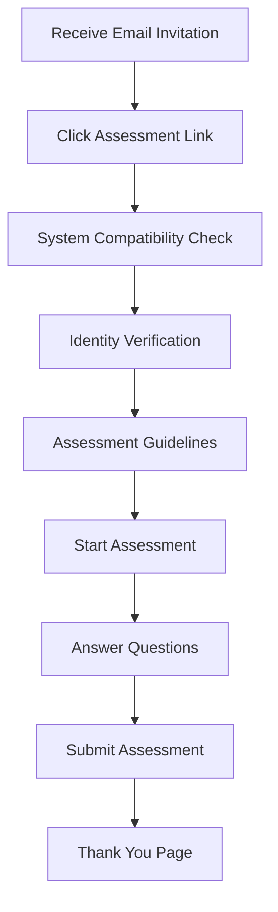

## Welcome to Skillment!

This quick start guide will help you create your first assessment and invite participants in just a few minutes. By the end of this guide, you'll have a fully functional assessment ready to use.

## Step 1: Access Your Dashboard

After signing up at [skillment.in](https://skillment.in/sign-up), log in to your dashboard at [app.skillment.in](https://app.skillment.in).

<Frame>
  
</Frame>

## Step 2: Create Your First Assessment

<Steps>
  <Step title="Navigate to Assessments">
    Click on "Assessments" in the left sidebar, then click "Create New Assessment"
  </Step>
  <Step title="Basic Information">
    Fill in your assessment details:
    - **Title**: "JavaScript Developer Test"
    - **Description**: "Basic JavaScript skills assessment"
    - **Duration**: 60 minutes
    - **Type**: Coding Assessment
  </Step>
  <Step title="Add Questions">
    Choose from our question bank or create custom questions:
    - Select "Add from Question Bank"
    - Filter by "JavaScript" and "Beginner"
    - Add 3-5 coding problems
  </Step>
  <Step title="Configure Settings">
    Set up assessment rules:
    - **Proctoring**: Enable basic monitoring
    - **Browser**: Lock browser during test
    - **Time Limit**: 60 minutes
    - **Attempts**: 1 attempt allowed
  </Step>
</Steps>

## Step 3: Invite Participants

<Steps>
  <Step title="Go to Participants">
    Click "Participants" in the sidebar, then "Add Participants"
  </Step>
  <Step title="Add Participant Details">
    Enter participant information:
    ```
    Name: John Doe
    Email: john.doe@example.com
    Role: Frontend Developer Candidate
    ```
  </Step>
  <Step title="Assign Assessment">
    Select the assessment you just created and set:
    - **Start Date**: Immediate or scheduled
    - **Deadline**: 7 days from now
    - **Instructions**: Custom message for the candidate
  </Step>
  <Step title="Send Invitations">
    Click "Send Invitations" to automatically email participants with:
    - Assessment link
    - Login credentials
    - Instructions and guidelines
  </Step>
</Steps>

## Step 4: Monitor Progress

Once participants start taking assessments:

<CardGroup cols={2}>
  <Card title="Real-time Monitoring" icon="eye">
    Watch live progress, detect violations, and see current status
  </Card>
  <Card title="Instant Notifications" icon="bell">
    Get alerts for assessment starts, submissions, and security violations
  </Card>
</CardGroup>

## Step 5: Review Results

After assessment completion:

<Steps>
  <Step title="Access Results">
    Go to "Results" tab in your assessment dashboard
  </Step>
  <Step title="Review Performance">
    See detailed analytics:
    - Code execution results
    - Time spent per question
    - Overall scores and rankings
  </Step>
  <Step title="Export Data">
    Download reports in PDF or Excel format for further analysis
  </Step>
</Steps>

## Sample Assessment Flow

Here's what your participant will experience:



## Quick Tips for Success

<AccordionGroup>
  <Accordion title="Choose the Right Questions" icon="lightbulb">
    Start with questions that match your candidates' expected skill level. Use our difficulty ratings to guide your selection.
  </Accordion>

  <Accordion title="Set Realistic Time Limits" icon="clock">
    Allow 10-15 minutes per coding question and 2-3 minutes per MCQ. Test the assessment yourself first.
  </Accordion>

  <Accordion title="Configure Proctoring Appropriately" icon="shield">
    For initial assessments, use basic monitoring. Enable advanced proctoring for final rounds or high-stakes evaluations.
  </Accordion>

  <Accordion title="Communicate Clearly" icon="message">
    Send clear instructions to participants including technical requirements and what to expect during the assessment.
  </Accordion>
</AccordionGroup>

## What's Next?

Now that you've created your first assessment, explore these advanced features:

<CardGroup cols={2}>
  <Card
    title="Question Bank Management"
    icon="database"
    href="/guides/question-bank"
  >
    Create custom questions and build your organization's question library
  </Card>
  <Card
    title="Advanced Proctoring"
    icon="video"
    href="/guides/proctoring-setup"
  >
    Set up AI-powered monitoring and violation detection
  </Card>
  <Card
    title="Team Collaboration"
    icon="users"
    href="/guides/team-management"
  >
    Add team members and manage permissions
  </Card>
  <Card
    title="Analytics Dashboard"
    icon="chart-bar"
    href="/guides/assessment-analytics"
  >
    Dive deep into performance metrics and insights
  </Card>
</CardGroup>

## Need Help?

<Note>
  **Stuck on something?** Our support team is available at [support@skillment.in](mailto:support@skillment.in), or check out our detailed guides for step-by-step instructions.
</Note>

## Common Next Steps

- **Bulk Import Participants**: Upload CSV files with hundreds of candidates
- **Custom Branding**: Add your organization's logo and colors
- **Integration Setup**: Connect with your ATS or HRMS system
- **Advanced Reporting**: Set up automated report generation
